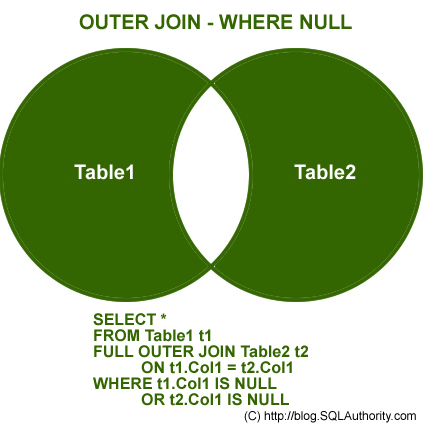

# Jose Portilla Udemy Course - The Complete SQL Bootcamp 2022: Go from Zero to Hero

## My collection of personal notes from the course

## Course Introduction

### Overview

-   Course will use PostgresSQL

-   Databases and Tables Basics
-   SQL Statement Fundamentals
-   GROUP BY Clause
-   Assesment Test over these topics

-   JOIN
-   Advanced SQL
-   Commands
-   2nd Assessment test

-   Create Databases and Tables
-   Assessment Test 3

Extra lectures

-   Views
-   PostgreSQL with Python

### Databases Overview

From Spreadsheets to Databases

**Spreadsheets**

-   One time analysis
-   quick charts
-   small datasets
-   untrained individuals

**Databases**

-   Data Integrity (cant just click a cell and change it)
-   massive data amounts
-   quick combine different datasets
-   automation
-   backend for web apps and apps

**Comparison**

-   Tabs in excel are like tables in a database
-   rows and columns are the same

**Database Platforms**

-   PostgreSQL = free & Open Source
-   MySQL & MariaSQL = Free & Open Source, widely used on internet
-   MS SQL Server Express = Free but has limitations, compatible with SQL Server (windows) only
-   Microsoft access = Cost is bad -, not easy to use just SQL
-   SQlite = Free (open source), mostly command line.

PostgreSQL is great for learning SQL

SQL (Structured Query Language) is the programming langauge used to communicate with databases

SQL is used in so much!

-   MySQL
-   PostGreSQL
-   Oracle Databases
-   MS Access
-   Amazon Redshift
-   Looker
-   MemSQL
-   Periscope Data
-   Hive (runs on top of hadoop)
-   BigQuery
-   Facebook's Presto

All of these applications use SQL in the background

Most of the commands we learn are **not** specific to PostGreSQL

**PostgreSQL** = SQL Engine

**PgAgmin** - GUI Interface for PostgreSQL

## SQL Statement Fundamentals

### SELECT Statement

Most common used statement

Allows us to retreive data from tables

syntax

```SQL
SELECT column_name FROM table_name;
```

You are **not** required to capitalize SQL commands but it is **best practice** as it seperates SQL Commands from tables, column names etc..

To grab all columns from the database, use:

```SQL
SELECT * FROM table_name;
```

**Word of caution:** Using `SELECT *` should only be used when you need to utilize every column in the database. Calling this command greatly increases traffic between the database server and the application, which can affect the speed of other queries. [AND HAS A LIST OF OTHER NEGATIVE EFFECTS](https://stackoverflow.com/questions/3639861/why-is-select-considered-harmful)

To get multiple columns,

```SQL
SELECT column_1,column_2 FROM table_name;
```

**Quick Note:** the semicolon ; at the end of the query just signifies the end of the statement. This is **optional**, but similar to capitilazation, this makes your statements easier to read and is **best practice**

### SELECT DISTINCT

Columns sometimes have duplicate values

Whenever you only want the distinct/unique values,

We use the `DISTINCT` keyword.

syntax,

```SQL
SELECT DISTINCT column FROM table;
```

to clarify which column the distinct operator is being applied to,

```SQL
SELECT DISTINCT(column) FROM table;
```

Parantheses are not necessary here but that does **not** apply to every SQL command

**Note:** when using `DISTINCT` with multiple columns and no parentheses, it gives you back distinct entries, so you may see the same value in one column more than once, but never the same entry in all columns for more than one row. It is a distinct collection of columns

```SQL
SELECT DISTINCT column_1,column_2 FROM table_name;
```

[Here is an example](https://www.w3resource.com/sql/select-statement/queries-with-distinct-multiple-columns.php)

### COUNT Function

Returns the number of input rows that match a specific condition of a query.

COUNT(column_name) is a function so it **should have** the parentheses.

**IMPORTANT NOTE: ** `SELECT COUNT(column_name)` and `SELECT COUNT(*)` will return the same thing, since you are just returning the number of rows in the dataset which all have that column, so use

```SQL
SELECT COUNT(*) FROM table_name
```

**Note:** The one instance where `SELECT COUNT(column_name)` is useful is for proper documentation. Say for instance you needed to count the number of some certain rows in table to answer a specific question about **one** column. When you look back on your `COUNT` function, the column name instead of \* will help you remember the report you were trying to generate or question you were trying to answer.

`COUNT()` by itself clearly just returns the number of rows in a table, which is somewhat useful

However, when `COUNT()` is combined with other SQL commands like `DISTINCT`, it becomes much more useful.

imagine we want to know how many unique names are in a table?

```SQL
SELECT COUNT(DISTINCT name) FROM table;
```

**Side Note:**

If we wanted to make the above query more readable, we could do:

```SQL
SELECT COUNT(DISTINCT(name)) FROM table;
```

That is preferred IMO

### SELECT WHERE Statement

SELECT and WHERE are the most fundamental SQL statements.

The **WHERE** statement allows us to specify certain conditions on columns for the rows that will be returned from our **SELECT** statement.

syntax

```SQL
SELECT column_1, column_2
FROM table
WHERE conditions
```

Well what are these _conditions_?

**Comparison Operators**

Compare a Column value to something.

-   Is the price greater than $3.00?
-   Is the pet's name equal to "Sam"?


**Logical Operators**

Allow us to combine multiple comparison operators

-   AND
-   OR
-   NOT

Example,

```SQL
SELECT name,choice
FROM table
WHERE name = 'David'
```

Now imagine multiple conditions

```SQL
SELECT name,choice
FROM table
WHERE name='David' AND choice='Red'
```

_Note that name and choice are representing two columns in a database_

### ORDER BY

Sort rows based on a column value

can be sorted numerically or alphabetically

syntax

```SQL
SELECT column_1, column_2
FROM table
ORDER BY column_1 ASC/DESC
```

`ORDER BY` comes after selection and happens at the bottom of the query. It is the last thing SQL does.

If you leave the `ASC/DESC` part blank, then it defaults to `ASC`

You can use `ORDER BY` on multiple columns.

It will order by your first entry first and then take all of those ordered rows and order them by your second column entry.

### LIMIT

Allows us to limit the number of rows returned for a query

Similar to `head()` in R or Python

Allows you to get a good grasp and preview of your returned data.

Also becomes very useful when paired with ORDER BY

**Goes at the very end of a query, last command to be executed**

syntax,

```SQL
SELECT * FROM payment
ORDER BY payment_date DESC
LIMIT 10;
```

A SQL query like that could help us answer a helpful business question like, what are the 10 most recent payments we have had?

### BETWEEN

Used to match a value against a range of values

-   value `BETWEEN` low `AND` high

Using the `BETWEEN` operator is equal to using the >= **and** <= operators (it is inclusive).

You can also combine `BETWEEN` and the `NOT` operator to get `NOT BETWEEN`

This is the same as saying < low `OR` value > high
value `NOT BETWEEN` low `AND` high

We are **exclusive** of the actual low and high statements when using `NOT BETWEEN` unlike the regular expression

the `BETWEEN` operator can be used on dates. You need to format the dates in the **ISO 8601** standard format, which is `YYYY-MM-DD`

```SQL
date BETWEEN '2007-01-01' AND '2007-02-01'
```

**NOTE:** datetime starts at 0:00, so pay close attention to inclusive and exclusive datetime queries

### IN

Whenever you want to check if a value appears in some dataset

For example,

If you want to check if the name _adam_ appears `in` some first_name column or users table.

syntax,

```SQL
value IN(option1,option2, .... option_n)
```

examples,

```SQL
SELECT color FROM table
WHERE color IN('red','blue')
```

Can be used with the `NOT` operator

```SQL
SELECT color FROM table
WHERE color NOT IN('red','blue')
```

### LIKE and ILIKE

We have already found solutions for queries where we need direct matches like first_name='john'

but what about certain situations where we need to query for a general pattern? Such as, emails ending in '@gmail.com' pr all names that begin with 'A'?

The `LIKE` operator allows us to permorm pattern matching against string data with the use of **wildcard** characters

What are **wildcard** characters?

1.) the **%** percent symbol, this allows us to match **any sequence of characters**
2.) the **\_** underscore symbol, matches any **single** character

examples,

All names that begin with an 'A'

```SQL
WHERE name LIKE 'A%'
```

Any string that starts with A and then has any sequence after that

All names that end with an 'a'

```SQL
WHERE name LIKE '%a'
```

**NOTE:** `LIKE` is case-sensitive, we can use ILIKE which is case-insensitive.

using the underscore allows us to replace a single character

example,

image we want to get all mission impossible films

```SQL
WHERE title LIKE 'Mission Impossible _'
```

this would give back mission impossible 1, mission impossible 2, etc...

You can use multiple underscoresm, which then leaves two character spots open,

We can combine pattern matching operators to create more complex patterns

```SQL
WHERE name LIKE '_her%'
```

-   Cheryl
-   Theresa
-   Sherri

Has to be one character before 'her' but can have as many as you want after 'her'

**NOTE:** Keep in mind that PostgreSQL does support full regex capabilities.

good example,

```SQL
SELECT \* FROM customer
WHERE first_name LIKE 'A%' AND last_name NOT LIKE 'B%'
ORDER BY last_name
```

All customers where first name starts with an 'A' and last name does not start with 'B'

How to check if a given word is in the column entries?

```SQL
SELECT COUNT(*)
FROM film
WHERE title LIKE '%Truman%'
```

This returns all the films with the word Truman in them.

## GROUP BY Statements

### Aggregate Functions

-   AVG() -> Returns average value
-   Count() -> Returns number of values
-   MAX() -> Returns max value
-   MIN() -> Returns min value
-   SUM() -> Returns the sum of all values

Aggregate functions happen only in the **SELECT** or **HAVING** clause.

```SQL
SELECT MAX(replacement_cost) FROM film
```

Keep in mind that adding another column

```SQL
SELECT MAX(replacement_cost), title FROM film
```

**Would not work** because our aggregate function is just returning a single value (in this case, max replacement cost)

### Group By - Part 1

Allows us to aggregate columns per some category

Need to choose a **categorical** column to perform group by on

Categorical columns are non-continous


```SQL
SELECT category_col, AGG(data_col)
FROM table
WHERE condition
GROUP BY category_col
```

The **GROUP BY** caluse has to come directly after a **FROM** statement or after a **WHERE** statement

In the **SELECT** statement, columns must either have an aggregate function or be in the **GROUP BY** call

### Group By - Part 2


Some important notes,

-   Order of the columns in the `SELECT` clause does not matter
-   Order of the columns in the `GROUP BY` clause does not matter?
-   Here, you can order by any columns or all columns

### HAVING Clause

Allows us to filter after an aggregation has already taken place

We can not use `WHERE` to filter by aggregate results because those happen after a `WHERE` is executed

`HAVING` allows us to use the aggregate result asa filter along with a `GROUP BY`

**EXAMPLE:**

Give us customer id's of customers with over 40 transactions

```SQL
select count(transactions), customer_id
from transactions
group by customer_id
HAVING count(transactions) >= 40
```

## JOINS

`JOINS` allow us to combine data from multiple tables

The reason that there are so many types is because we have to decide what to do with data present in only one of the tables

### AS Clause

Allows us to create an alias for a column or result

How to rename a column in SQL result,

```SQL
SELECT column as new_name
FROM table
```

How to rename result,

```SQL
SELECT SUM(column) AS new_name
FROM table
```

How is this useful?

Well if we are demonstrating analytics and want to rename a column,

```SQL
SELECT SUM(amount) AS net_revenue
FROM payment;
```

**NOTE:** The`AS` operator gets executed at the very end of a query, meaning that we can not use the ALIAS inside of a `WHERE` operator

Basically you can not use your alias inside your sql statements

Another useful alias,

```SQL
SELECT COUNT(*) AS num_transactions
FROM payment
```

### INNER JOIN

The `INNER JOIN` is the most basic join operation

the result of this `INNER JOIN` is the set of records that **match in both** tables

**syntax,**

```SQL
SELECT * FROM TableA
INNER JOIN TableB
ON TableA.col_match = TableB.col_match
```


Table order does not matter in the `INNER JOIN`

In postgresSQL, you can just use `JOIN` for an inner join

### FULL OUTER JOIN

**OUTER JOINS** allow us to specify how to deal with values only present in one of the tables being joined


**Syntax**,

```SQL
SELECT * FROM TableA
FULL OUTER JOIN TableB
ON TableA.col_match = TableB.col_match
```

A **FULL OUTER JOIN** grabs everything from both tables and _attempts_ to match it with the other table, however if it fails to match then it will still add all records regardless (which then creates a bunch of null values)

There is also the option to just get the nonmatching records from both tables, we simply use a **WHERE** clause and identify records that returned a null value



### LEFT OUTER JOIN

A **LEFT OUTER JOIN** results in the set of records that are in the left table, if there is no match with the right table, the results are null.

We can add the **WHERE** statement to further modify our **LEFT OUTER JOIN**

**Syntax,**

```SQL
SELECT * FROM TableA
LEFT OUTER JOIN TableB
ON TableA.col_match = TableB.col_match
```

**NOTE:** Order matters! This is not a symetrical operation


**What if we only wanted entries that our unique to our left table and not matching ones with the right table?**

```SQL
SELECT * FROM TableA
LEFT OUTER JOIN TableB
ON TableA.col_match = TableB.col_match
WHERE TableB.id IS null
```

That statement gives us the following,


### RIGHT JOIN

A **RIGHT JOIN** is essentially the same as a **LEFT JOIN**, except the tables are switched.

This would be the same as switching the table order in a **LEFT OUTER JOIN**

**Syntax,**

```SQL
SELECT * FROM TableA
RIGHT OUTER JOIN TableB
ON TableA.col_match = TableB.col_match
```

By just using the left join, it can simplify your mental space (all preference)

_This section was skipped a bit due to the point above_

### UNION

-   The **UNION** operator is used to combine the result-set of two or more **SELECT** statements
-   It basically serves to directly concatenate two results together, essentially "pasting" them together.

**Syntax,**

```SQL
SELECT column_name(s) FROM table1
UNION
SELECT column_name(s) FROM table2
```

# Advanced SQL Commands

### Timestamps and Extract - Part One

PostgreSQL can hold date and time information

-   **TIME** - Contains only time
-   **DATE** - Contains only date
-   **TIMESTAMP** - Contains date and time
-   **TIMESTAMPZ** - Contains date, time, and timezone

When creating a database, careful consideration should be taken into account when deciding time types

Here are some functions that are useful when populating a database,

-   **TIMEZONE** - Gives you your current timezone
-   **NOW** - Gives you _TIMESTAMPZ_ information right now
-   **TIMEOFDAY** - A text string value of NOW
-   **CURRENT_TIME** - Subsets of the commands above, gives current time with timezone
-   **CURRENT_DATE** - gives current date yyyy-mm-dd

### Timestamps and Extract - Part Two

**EXTRACT()**

Allows you to **"extract"** or obtain a sub-component of a date value

-   Year
-   Month
-   Day
-   Week
-   Quarter

**Syntax,**

```SQL
EXTRACT(YEAR FROM date_col)
```

**AGE()**

Calculates and returns the current age given a timestamp

**syntax,**

```SQL
AGE(date_col)
```

This returns,

`13 years 1 mon 5 dats 01:34:13.003423`

**TO_CHAR()**

General function to convert data types to text

Useful for timestamp formatting

**syntax,**

```SQL
TO_CHAR(date_col,'mm-dd-yyyy')
```

### Mathematical Functions and operators

There is a vast majority of mathematical operators to utilize in SQL

There is loads of documentation on all of them according to your DB

-   Addition
-   Subtraction
-   Multiplication
-   Division
-   Modulus

### String Functions and Operators

Again, there is a vast majority of string function that we can utilize in SQL

Here are some of the more useful string functions,

-   ASCII()
-   BIN()
-   BIT_LENGTH()
-   CHAR_LENGTH()
-   CONCAT()

Here is [some good documentation](https://www.geeksforgeeks.org/sql-string-functions/) for string functions

### SubQuery

Helps us get the result in a single query request

-   Compare an expression to the result of the query
-   Determine if an expression is included in the results of the query
-   Check whether the query selects any rows
-   The subquery (inner query) executes once before the main query (outer query) executes.
-   The main query (outer query) use the subquery result.

**Syntax,**


**Example,**

```SQL
SELECT student, grade
FROM test_scores
WHERE student IN
(SELECT student
FROM honor_roll_table)
```

A useful operator to use with the SubQuery is the `EXISTS` operator

The `EXISTS` operator returns true or false based on if there are any records returned

```SQL
SELECT column_name
FROM table_name
WHERE EXISTS
(SELECT column_name FROM
table_name WHERE condition);
```

### Self-Join

A query in which a table is joined to itself

Useful for comparing values in a column within the same table

Now there is no special keyword for a self-join, it is just the way you phrase your **JOIN** statement.

**Syntax**, Pay close attention

```SQL
SELECT tableA.col, tableB.col
FROM table as tableA
JOIN table AS tableB ON
tableA.some_col = tableB.other_col
```

**NOTE:** all tables in that SQL statement are all pointing to the same table

## Creating Databases and Tables

We have mainly gone over how to query and how to generate solid reports, this section will be about actually developing a database with SQL

### Data Types

-   Boolean - True or False
-   Character - Char,varchar, and text
-   Numeric - Integer and floating-point number
-   Temporal - date,time, timestamp, and interval
-   UUID - Universally Unique Identifiers
-   Array - Stores an array of strings, numbers, etc
-   JSON
-   Hstore key-value pair
-   Special types such as network address and geometric data

The internet is your friend when deciding which data type to pick for your column (Best Practices).

Remember you can always remove excess information from a table, but you cant add historical data

### Primary Keys and Foreign Keys

A **primary key** is a column or a group of columns used to identify a row uniquely in a table

-   Important because they help us decide which columns to use when joining two tables together.

A **foreign key** is a field or group of fields in a table that uniquely identifies a row in another table

-   Defined in a table that references to the primary key of the other table
-   Table that contains the foreign key is called **referencing table** or **child table**
-   Table to which the foreign key references is called **referenced table** or **parent table**
-   A table can have multiple foreign keys depending on its relationships with other tables

### Constraints

Constraints are the **rules** enforced on data columns on table

These are used to prevent invalid data from being entered into the database

Ensures **accuracy** and **reliability** of the data in the database

There are two kinds of constraints,

-   **Column Constriants** - Constrains the data in a column to adhere to certain conditions

-   **Table Constraints** - Applied to the entire table rather than an individual column

**Most common column constraints,**

-   **NOT NULL** - Ensures that a column cannot have a NULL value

-   **UNIQUE** - Ensures that all values in a column are different

-   **PRIMARY Key** - Uniquely identifies each row/record in a database table

-   **Foreign Key** - Constrains the data based on columns in other tables.

-   **CHECK** - Ensures that all values in a column satisfies certain conditions

-   **EXCLUSION** - Ensures that if any two rows are compared on the specified column or expression using the specified operator, not all of these comparisons will return true

**Most common table constraints,**

-   **CHECK (condition)** - To check a condition when inserting or updating data

-   **REFERENCES** - To constrain the value stored in the column that must exist in a column in another table

-   **UNIQUE (column_list)** - Forces the values stored in the columns listed inside the parantheses t be unique

-   **PRIMARY KEY (column_list)** - Allows you to define the primary key that consists of multiple columns

### CREATE Table

Creates a database table

**Syntax,**

```SQL
CREATE TABLE table_name(
    column_name TYPE column_constraint,
    column_name TYPE column_constraint,
    table_constraint table_constraint
) INHERITS existing_table_name
```

**Common Simple Syntax,**

```SQL
CREATE TABLE table_name (
    column_name TYPE column_constraint,
    column_name TYPE column_constraint,
)
```

There is a SERIAL datatype that we can use which basically **autoincrements** our primary key column.

The way we specify this is,

```SQL
CREATE TABLE players(
    player_id SERIAL PRIMARY KEY,
    age SMALLINT NOT NULL,
)
```

### INSERT

Allows you to add in rows to a table

**Syntax,**

```SQL
INSERT INTO table(column1,column2,...)
SELECT column1,column2,...
FROM another_table
WHERE condition;
```

Keep in mind, the inserted row values must match up for the table, including constraints

**SERIAL** columns do not need to be provided a value

**Example,**

```SQL
INSERT INTO account(username,password,email,created_on)
VALUES
('Jose','password','jose@mail.com',CURRENT_TIMESTAMP)
```

### UPDATE

Allows for the changing of values of the columns in the table

**Syntax,**

```SQL
UPDATE table
SET column1 = value1,
    column2 = value2, ...
WHERE
    condition;
```

**Example,**

```SQL
UPDATE account
SET last_login = CURRENT_TIMESTAMP
    WHERE last_login IS NULL;
```

If you leave the **WHERE** condition out of the statement, It will update every record in the table

```SQL
UPDATE account
SET last_login = CURRENT_TIMESTAMP
```

You can also update all the records based on another column in the table

```SQL
UPDATE account
SET last_login = created_on
```

We can also update by using another tables values (UPDATE join)

```SQL
UPDATE TableA
SET original_col = TableB.new_col
FROM tableB
WHERE tableA.id = TableB.id
```

**IMPORTANT:** The **UPDATE** clause does not return any information, _unless_ we use the **RETURNING** clause.

as shown,

```SQL
UPDATE account
SET last_login = created_on
RETURNING account_id,last_login
```

### DELETE

We can use the **DELETE** caluse to remove rows from a table

**syntax example,**

```SQL
DELETE FROM table
WHERE row_id = 1
```

We can delete rows **based on their presence in other tables**

Example,

```SQL
DELETE FROM tableA
USING tableB
WHERE tableA.id = TableB.id
```

We can delete **all** rows from a table,

**NOTE:** that when you use delete instead of **TRUNCATE**, it logs all of the deleted records (so you can roll back if needed).

```SQL
DELETE FROM table
```

-   Similar to **UPDATE** command, you can also add in a **RETURNING** call to return rows that were removed.

### ALTER Clause

Allows for changing to an existing table structure, such as,

-   Adding, Dropping, or Renaming Columns
-   Changing a column's data type
-   Set DEFAULT values for a column
-   Add CHECK Constraints
-   Rename table

**General syntax,**

```SQL
ALTER TABLE table_name action
```

For example, Let's see how to **add columns to a table,**

```SQL
ALTER TABLE table_name
ADD COLUMN new_col TYPE
```

And Removing Columns,

```SQL
ALTER TABLE table_name
DROP COLUMN col_name
```

**Change the constraints** of an existing column,

```SQL
ALTER TABLE table_name
ALTER COLUMN col_name
SET DEFAULT value
```

How to **change table name,**

```SQL
ALTER TABLE table_name
RENAME TO new_table_name
```

### DROP Table

Allows for the complete removal of a column in a table

In PostgreSQL this will also automatically remove all of its indexes and constraints involving the column

However, it will not remove columns used in views triggers or stored procedures without the additional CASCADE clause.

**Syntax,**

```SQL
ALTER TABLE table_name
DROP COLUMN col_name CASCADE
```

**Best practice**, check for existence to avoid error, as shown,

```SQL
ALTER TABLE table_name
DROP COLUMN IF EXISTS col_name
```

You can drop multiple columns,

```SQL
ALTER TABLE table_name
DROP COLUMN col_one
DROP COLUMN col_two
```

### CHECK Constraint

Allows us to create more customized constraints that adhere to a certain condition

An example would be making sure all inserted integer values fall below a certain threshold

**Syntax example,**

```SQL
CREATE TABLE example(
    ex_id SERIAL PRIMARY KEY
    age SMALLINT CHECK (age > 21)
    parent_age SMALLINT CHECK (
        parent_age > age)
);
```

**NOTE**: If a record fails to insert and you are using a **SERIAL** data type for your PK, the **SERIAL** data column will still increment. Leading to you having random jumps in your PK column (like 2 to 4, etc...)

## Conditional Expressions and Procedures

Overview

-   CASE
-   COALESCE
-   NULLIF
-   CAST
-   Views
-   Import and Export Functionality

These commands allow us to add logic to our queries and workflows

### CASE

We can use this statement to only execute SQL code when certain conditions are met

This is very similar to if/else in other programming languages

There are two main ways to use a **CASE** statement, either a **general CASE** or a **CASE expression**

Both methods can lead to the **same** result

**General CASE syntax,**

```SQL
CASE
    WHEN condition1 THEN result1
    WHEN condition2 THEN result2
    ELSE some_other_result
END
```

**The result will come back in the form of another column, it will test your row for the condition and then return the result in your CASE column.**

Here is an example,

```SQL
SELECT a,
CASE WHEN a = 1 THEN 'one'
     WHEN a = 2 THEN 'two'
ELSE 'other'
END
FROM test;
```

This would then add the **CASE** column in your query result. The column by default is called **CASE**

If you wish to change the default name, (add **AS** clause)

```SQL
SELECT a,
CASE WHEN a = 1 THEN 'one'
     WHEN a = 2 THEN 'two'
ELSE 'other' AS label
END
FROM test;
```

**CASE Expression syntax,**

The CASE Expression will first evaluate an expression then compare the result with each value in the **WHEN** clauses sequentially

This can be confusing because it looks very similar to the **General Case Syntax**

This is generally used to just test for equality, it is much less flexible than the **General CASE**

Here is the **syntax,**

```SQL
CASE expression
    WHEN value1 THEN result1
    WHEN value2 THEN result2
    ELSE some_other_result
END
```

Here is an example using the **CASE Expression syntax,**

```SQL
SELECT a,
    CASE a WHEN 1 THEN 'one'
        WHEN 2 THEN 'two'
[](CompleteSQLBootCamp.md)        ELSE 'other'
    END
FROM test;
```
