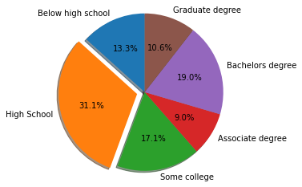
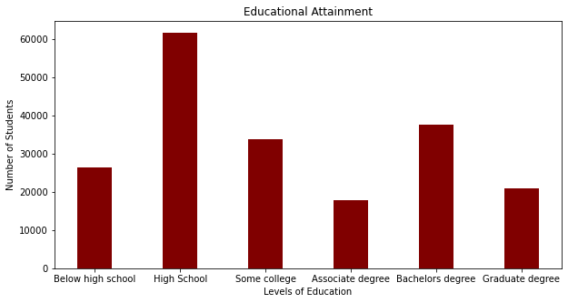
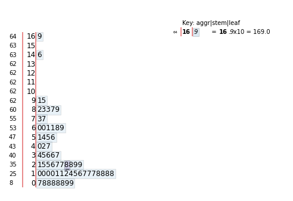
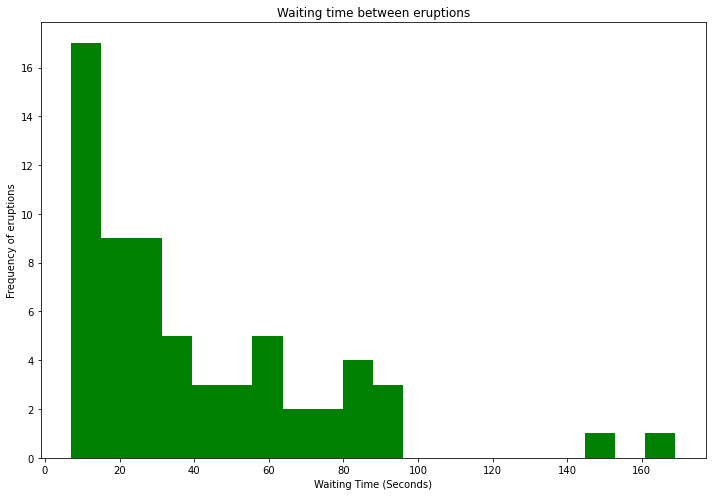
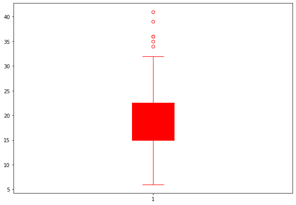

# Stats with python

## How to create pie graph

```
import matplotlib.pyplot as plt

labels = 'Below high school', 'High School', 'Some college', 'Associate degree', 'Bachelors degree', 'Graduate degree'
sizes = [26414,
61626,
33832,
17838,
37635,
20938,
]

explode = (0,0.1,0,0,0,0) # only explode high school

fig1, ax1 = plt.subplots()
ax1.pie(sizes,explode=explode,labels=labels,autopct='%1.1f%%',
       shadow=True, startangle=90)
ax1.axis('equal')

plt.show()
```

**Labels** - define the labels that will appear outside of each pie slice

**sizes** - This is the actual data that will be converted to percentages for each pie slice.

**explode** - This makes a cool effect on a pie slice you want to bring attention to, it pops it out more than the other ones.

What is `fig1, ax1` for? [Here read this](https://stackoverflow.com/questions/34162443/why-do-many-examples-use-fig-ax-plt-subplots-in-matplotlib-pyplot-python)

**plt.show** - this allows us to see our graph on display (in our environment), although jupyter notebook calls this by default



## How to create bar graph

```
import matplotlib.pyplot as plt

labels = 'Below high school', 'High School', 'Some college', 'Associate degree', 'Bachelors degree', 'Graduate degree'
sizes = [26414,
61626,
33832,
17838,
37635,
20938,
]

fig = plt.figure(figsize=(10,5))

plt.bar(labels,sizes, color='maroon', width=0.4)


plt.xlabel("Levels of Education")
plt.ylabel("Number of Students")
plt.title("Educational Attainment")
plt.show()A
```

Here `fig` creates our display size, it has two parameters (x,y)

`plt.bar` creates our bar graph it takes in our labels, data, color of bars, and width

**width** - The distance between each bar on the display



## How to create stem-and-leaf plot

We are going to use a library called stemgraphic

```
pip install stempgraphic
```

Then

```
import stemgraphic

data = [83,51,87,60,28,95,8,27,15,10,18,16,29,54,91,8,17,55,10,35,47,77,36,17,21,36,18,40,10,7,34,27,28,
56, 8, 25,68,146,89,18,73,69,9,37,10,82,29,8,60,61,61,18,169,25,8,26,11,83,11,42,17,14,9,12]

stemgraphic.stem_graphic(data, scale=10)
```

This produces...



The leftmost column is our **frequency count**

## How to create a histogram

A histogram is basically a bar plot except all of the bars are connected

```
from matplotlib import pyplot as plt
import numpy as np

#create dataset
a = np.array([83,51,87,60,28,95,8,27,15,10,18,16,29,54,91,8,17,55,10,35,47,77,36,17,21,36,18,40,10,7,34,27,28,
56, 8, 25,68,146,89,18,73,69,9,37,10,82,29,8,60,61,61,18,169,25,8,26,11,83,11,42,17,14,9,12
])

#creating histogram
fix, ax = plt.subplots(1,1,figsize=(10,7), tight_layout=True)
ax.hist(a,bins =20, color="green")

#show plot
plt.xlabel("Waiting Time (Seconds)")
plt.ylabel("Frequency of eruptions")
plt.title("Waiting time between eruptions")
plt.show()
```

Same overall concept as the ones above, use higher bins for skinnier bars



**NOTE:** This is a right skewed plot

## How to create a boxplot

Here is a quick snippet to convert a long list of copied values with no comma between that you need into a list

```
nums = [int(num) for num in """
13 14 8 10 16 26 32 27 18 32 36 24 22 23 22 18 25 21 21 14  8 11 14 23 18  17 19 20 22 19 13 26 13 14 22 24 21 22 26 21 23 24 27 41 31 27 35 26 28 36  39 21 17 22 17 19 15 34 10 15 22 18 15 20 15 22 19 16 30 27 29 23 20 16 21  21 25 16 18 15 18 14 10 15  8 15  6 11  8  7 18 16 13 12 13 20 15 16 12 18  15 16 13 15 16 11 11 18 12 17 24 20 16 19 12 19 16 7 17
""".split()]
```

That returns a list ^

Here is the code to generate an ugly boxplot

```
import matplotlib.pyplot as plt
import numpy as np

c='red'

fig = plt.figure(figsize=(10,7))

plt.boxplot(nums, patch_artist=True, boxprops=dict(facecolor=c, color=c),
            capprops=dict(color=c),
            whiskerprops=dict(color=c),
            flierprops=dict(color=c, markeredgecolor=c),
            medianprops=dict(color=c),)

plt.show()

```

This comes out with an all red boxplot

As we can see all of our plots are initiated with the figure frame (identified by `fig`)

Most of the parameters here all have to do with setting the color of our boxplot, if we had more than one box in the plot then we would have to itterate through each box.


