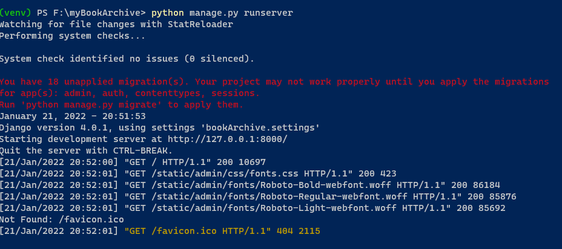
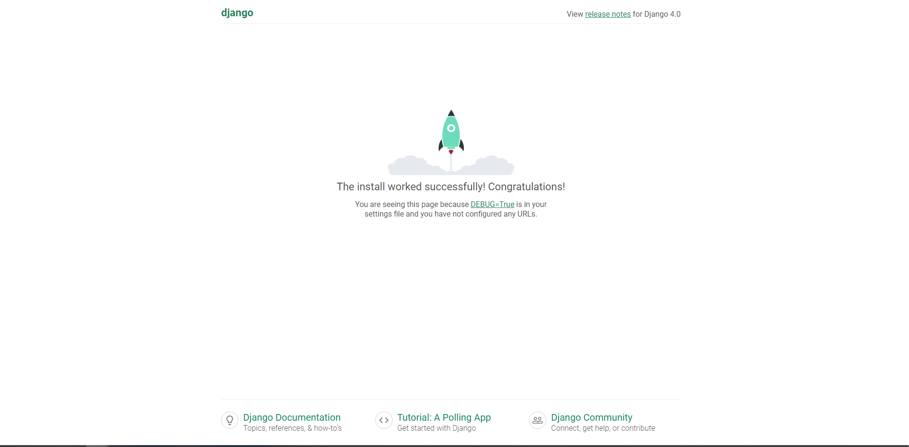

# Python Django

## Creating a django project

-   Make sure you are in a virtual environment
-   Make sure you pip install django

Let's start our project

Inside your project folder run this in shell,

```
django-admin startproject "project-name" .
```

The `.` at the end let's django know that we are already in our working environment and that there is no need to add a root `"project-name"` folder

We should now have `venv\`, `"project-name"\`, and `manage.py` in our project folder

In the root folder run a `python manage.py runserver`, this will let you know if it is working





This runs a web server written entirely in python, made for development.

> **NEVER USE THIS IN PRODUCTION, IT IS ONLY MADE FOR DEVELOPMENT**

We will stick to something like apache for production.

## Creating apps within our django project

Projects vs. apps

What’s the difference between a project and an app? An app is a web application that does something – e.g., a blog system, a database of public records or a small poll app. A project is a collection of configuration and apps for a particular website. A project can contain multiple apps. An app can be in multiple projects.

to create an app in our project...

```
python manage.py startapp "app-name"
```

This creates a top level module if you ran that in the root with manage.py

Apps come with this file structure inside of them...

```
"app-name"/
    __init__.py
    admin.py
    apps.py
    migrations/
        __init__.py
    models.py
    tests.py
    views.py
```

## Views

Inside our app we have a views.py file

A view function, or view for short, is a Python function that takes a web request and returns a web response. This response can be the HTML contents of a web page, or a redirect, or a 404 error, or an XML document, or an image . . .

Let's add this to our views.py file (at the top)

```
from django.http import HttpResponse
```

When a page is requested, django creates an HttpRequest object.

This HttpRequest object contains metadata about the request.

each view is responsible for returning an HttpResponse object.

let's add a view to views.py

```
def index(request):
    return HttpResponse("Hello world")
```

In order to call this view we need to map it to a url

Create a `urls.py` file in your **APP** folder, not project folder

in `urls.py` add these references,

```
from django.urls import path
from . import views
```

This imports our necessary modules into our file

now me must add paths to our `urls.py` file,

```
urlpatterns = [
    path('', views.index, name='index')
]
```

These will all add views under url app/your-views

The **first** parameter describes the path of the views route.

the **second** parameter describes which view we want to reference.

the **third** gives our url a metadata type name to be used for other stuff?

Now we must configure this group of url paths under it's app domain.

So we head to the **project folder -> urls.py**

```
from django.contrib import admin
from django.urls import include, path

urlpatterns = [
    path('admin/', admin.site.urls),
    path('app-name/', include('app-name.urls')) //we add all of our project/app-name/URLS
]
```

## Database Setup

By default, django uses **SQLite**.

**SQLite** is included with python, so no need to worry about installing anything.

When making a production site, we may want to use a more scaleable database like **postgreSQL**

> If you wish to use another database, install the appropriate database bindings and change the following keys in the DATABASES 'default' item to match your database connection settings:
> ENGINE – Either 'django.db.backends.sqlite3', 'django.db.backends.postgresql', 'django.db.backends.mysql', or 'django.db.backends.oracle'. Other backends are also available.
> NAME – The name of your database. If you’re using SQLite, the database will be a file on your computer; in that case, NAME should be the full absolute path, including filename, of that file. The default value, BASE_DIR / 'db.sqlite3', will store the file in your project directory.
> If you are not using SQLite as your database, additional settings such as USER, PASSWORD, and HOST must be added. For more details, see the reference documentation for DATABASES.

[good reference for database basics](https://docs.djangoproject.com/en/4.0/intro/tutorial02/)

## Forms

**GET** - returns the submitted data as a string, along with the data keys and values in the URL.

GET is unsuitable for password forms because of the above information

GET is mostly used for web search forms because this is obviously public information. (Your searching it)

**POST** - used to make a change in the database

### How does django get involved with form validation?

We know that django is a very battery included framework.

This is essential to bring up when we are talking about form validation.

Django handles three main parts

-   Prepares and restructures the data to make it ready for rendering

-   Automatically creates HTML forms for data entry

-   Recieves and processes submitted client side forms

**NOTE**: Everyone can write this code but it would take a lot of effort and time. Django gives you this functionality off the bat.

### How does the django form class work

A django form class attributes map to HTML `<input>`

**NOTE**: It would be redundant to create form attributes to create an object in the database, if that database object already has defined fields.

In this case we can just set

`model='YOUR-MODEL'`

We set that in the `Meta` class of our parent form class.

Everything outside the `Meta` class is what is not inherited from your database model.

**Example**:

```
class registerUserForm(UserCreationForm):
    email = forms.EmailField(required = True)

    class Meta:
        model = User
        field = ("username", "email", "password1", "password2")

    def save(self, commit=True):
        user = super(registerUserForm, self).save(commit=False)
        user.email = self.cleaned_data['email']
        if commit:
            user.save()
        return user
```

Attempting to understand `super(registerUserForm,self)`

> The super() call creates a super object. It finds the next class after B in self.**class**.**mro**. Attributes accessed on the super object are searched on the next class and returned. Descriptors are resolved. When using super() the first parameter should always be the same as the class in which it is being used

This calls the next class in our MRO or `registerUserForm`

[MRO](https://stackoverflow.com/questions/7141820/use-of-python-super-function-in-django-model) - is the method resolution order

**NOTE**: We are not necessarily calling the parent class but just following the MRO.

Just remember we are not calling our save class, we are calling some other class's save class.

### AN important note on how form classes are utilized

> So when we handle a model instance in a view, we typically retrieve it from the database. When we’re dealing with a form we typically instantiate it in the view.
> When we instantiate a form, we can opt to leave it empty or pre-populate it, for example with:
>
> -   data from a saved model instance (as in the case of admin forms for editing)
> -   data that we have collated from other sources
> -   data received from a previous HTML form submission

So by using a created django form we are basically creating an instance of our database model and if the POST data is valid then we choose to save that instance.

## Templates

```
Placed in <PROJECT>/<APP>/templates/<APP>/template.html for app-specific templates to help with making the app reusable elsewhere.

For general "global" templates I put them in <PROJECT>/templates/template.html
```

### How do we reference the base template in project directory from app templates?

```
You can tell Django to look in PROJECT_ROOT/some_app/templates by editing the settings.py file - for example: 'DIRS': [os.path.join(BASE_DIR, "templates")]
```

and then in your app templates folder...

```

```
