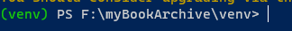

# Virtual Environment

We often use packages and modules that are not from the standard python library. This

This presents an issue when someone tries to replicate our project and they are using different versions of those packages and modules.

The solution to this is a **virtual environment**

## What is a virtual environment?

A **virtual environment** acts as a container for your python project.

This container houses your version of python and all other packages.

## How do I install a virtual environment?

The module used to create and manage python virtual environments is called `venv`

### 1.) Navigate to the project directory

```
cd my-example-project
```

### 2.) Create a virtual environment

```
python -m venv "name-of-your-venv-folder"
```

This will create a virtual environment in the directory called `"name-of-your-venv-folder"` within your project folder.

### 3.) Activate your virtual environment

Last thing to do is activate your virtual environment within your python project.

Navigate into the venv folder

```
cd "name-of-your-venv-folder"
```

Then,

```
name-of-your-venv-folder> scripts/activate
```

Congrats, you should now have your python in a virtual environment...



The `(venv)` before your directory path shows you are in an activate virtual environment.

Do a `pip freeze`, just to double check (it should come up empty)
